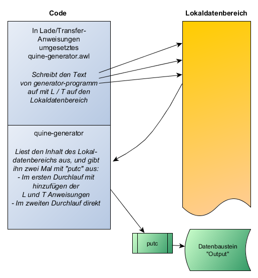

# Step7-Quine-AWL

Diese ist eine Beispielimplementation eines Quine-Programms für Siemens S7
Steuerungen (300/400) in der Programmiersprache AWL (Anweisungsliste).

Die ursprüngliche Aufgabe stammt aus dem SPS-Forum aus dem Jahr 2016:
"Schreiben Sie ein Programm in S7 AWL welches den eigenen Quellcode ausgibt".

Aus Wikipedia:
"Ein Quine ist ein Computerprogramm, das eine Kopie seiner selbst
(üblicherweise seines Quelltextes) als Ausgabe schreibt."

Das Quine-Programm muss nur die eigentlichen Code ausgeben, ohne Funktions-Header oder
Kommentare.

## Umsetzung der Zeichenausgabe

Da die S7 keine print-Funktion zur Ausgabe von Texten oder Zeichen mitbringt,
wird eine eigene Funktion *putc* zur Verfügung gestellt, welche ein einzelnes Zeichen
als Argument übergeben bekommt, und anstelle dieses auf einem Bildschirm auszugeben, wird der
Inhalt in einem globalen Datenbaustein zur Verfügung gestellt.

Die Funktion *putc* wie auch der Datenbaustein zur Ausgabe wird als Teil des Betriebssystems / der
Programmiersprache angesehen, und muss nicht im Rahmen des Quine-Programmes mit ausgegeben werden.

Für die Aufgabe werden dementsprechend der DB1 "Output":

```
DATA_BLOCK "Output"
  STRUCT 	
   act_len : INT ;              // Actual length of the string
   s : ARRAY  [0 .. 10000 ] OF  // The output string
   CHAR ;	
  END_STRUCT;
BEGIN
END_DATA_BLOCK
```

sowie die Funktion "putc" FC1 beigestellt:

```
FUNCTION "putc" : VOID
TITLE =Print a single character

VAR_INPUT
  c : CHAR ;	//The char to be printed
END_VAR
VAR_TEMP
  ptr : DWORD ;	
END_VAR
BEGIN
NETWORK
TITLE =
      L     "Output".act_len; 
      L     2; // Startoffset
      +I    ; 
      SLD   3; 
      T     #ptr; 
      AUF   "Output"; 
      L     #c; 
      T     DBB [#ptr]; 
      L     "Output".act_len; 
      +     1; 
      T     "Output".act_len; 
END_FUNCTION
```

## Umsetzung der Beispiellösung (Solution-1)
Die hier vorgestellte Lösung, besteht aus einem grundlegenden *quine-generator.awl* geschrieben in AWL, welches Daten aus dem
Lokaldatenbereich in einer Schleife einliest und über putc ausgibt. Zur "Quinierung" weden hier bestimmte Zeichen die zur Ausgabe
des eigentlichen Codes später verwendet werden, die Hexadezimalwerte der Zeichen in Variablen abgelegt
(#q = ', #L = L, #T = T, #D = D, #A = Leerzeichen, #n = Zeilenumbruch).

Der im Lokaldatenbereich gespeicherte Quelltext wird zweimalig durch das Programm ausgegeben. Im ersten Durchlauf werden 4 Zeichen
durch Ladeanweisung quotifiziert, d.h. der Inhalt wird in "L '" und "'" eingepackt. Die Transferanweisung wird durch "T LD n" mit einer
automatisch generierten Adresse n auf dem Lokaldatenstack erzeugt.

Mittels des in Python geschriebenen Konvertierungsprogramm *awl-quine-helper.py* wird der Code von *quine-generator.awl* eingelesen,
und in eine Serie aus 4 Byte Lade- und Transferanweisungen umsetzt, um den eigentlichen Quellcode von *quine-generator.awl* im
Lokaldatenbereich (Stack) abzulegen. Das könnte auch manuell geschehen, das Hilfsprogramm vereinfacht den Vorgang.

Das Ergebnis von *awl-quine-helper.py* wird dem Code von *quine-generator.awl* vorangestellt, und ergibt das Zieprogramm
*quine-complete.awl*. Diese ist das eigentliche Lösungsprogramm welche die Bedingungen eines Quines erfüllt.

Für den Vergleich müssen noch alle unnötigen Leerzeichen entfernt werden. Diese in den Code mit aufnehmen wäre zwar möglich,
würde die Lösung aber unnötig verlängern.

Die Länge des *quine-generator.awl* als String muss ein Vielfaches von 4 sein, welches händisch durch Anpassung
der Länge von Variablennamen oder Sprunglabeln daraufhin optimiert wurde.

Die Lösung verwendet mindestens 812 Byte auf dem Lokaldatenstack (812 byte für den Code von *quine-generator.awl*, sowie den
Hilfsvariablen #q, #L, #T, usw., und ist deshalb nicht auf allen (vor allem älteren / kleineren) S7
Steuerungen lauffähig. Das Problem kann aber umgangen werden, in dem das Prizip beibehalten wird und die Daten nicht auf
dem Lokaldatenstack sondern in den statischen Daten eines Funktionsbausteins abgelegt werden, welcher dieser Größenbeschränkung nicht
unterliegt.



